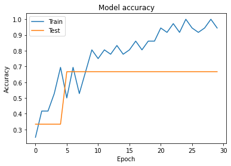

# EEG_CNN_Fine_Tuning
I used MNE package to load physionet motor imagery dataset. I used the CNN in references to apply keras-optimizer on it!

# Steps
1. Load raw
2. filter 6-13 Hz
3. Crop signal window
4. Create train and test data
5. Apply them on CNN

# Result

# References
- [Blog GCNs by Thomas Kipf](https://github.com/shariharan205/Motor-Imagery-Tasks-Classification-using-EEG-data)
